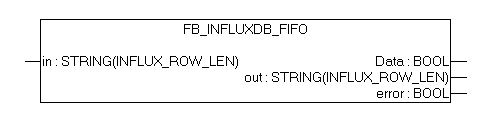
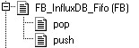
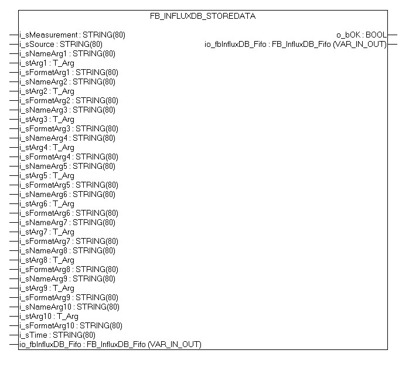
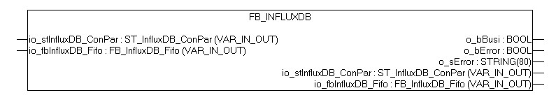

# TwinCat-InfluxDB

Twincat and ADS is from Beckhoff ©. I'm not affiliated.

The Binary Tool is a tool to read, write and convert a buffer.

It is written for Beckhoff Twincat 2.11 or higher.

In TwinCat 3, the implementation can be solved more elegantly. It is therefore not intended for TwinCat 3.

### It was created as an aid to the implementation of the InfluxDB library. It is inspired by Aapo Vuoristo on [Aapo TwinCAT Pages](http://ajv.lautatarha.com)
Have a look on [Aapo TwinCAT Pages](http://ajv.lautatarha.com/beckhoff/twincat-to-influxdb)


# Additional libraries

## TwinCat-BinaryTool 
#### BinaryTool_1.0.0.0.lib
You have to download the [TwinCat-BinaryTool](https://github.com/PLCHome/Twincat-BinaryTool/archive/v1.0.0.0.zip) librarie

## TS6310 TwinCAT TCP/IP Server 
#### TCPIP.lib
You need a license of the TwinCAT TCP/IP [librarie](https://infosys.beckhoff.com/content/1033/tcpipserver/html/note.htm?id=1943724678174118634)

[Windows Download](https://www.beckhoff.com/forms/twincat3/warenkorb.aspx?lg=de&title=TS6310-TCP-IP&version=3.1.6)
[Windows CE Download](https://www.beckhoff.com/forms/twincat3/warenkorb.aspx?lg=de&title=TS6310-0030-TCP-IP-CE&version=3.1.6)


# FUNCTION_BLOCK
### FB_InfluxDB_Fifo
You need an instance so the communication can work.
VAR_INPUT
	in					: string argument for the action push.
VAR_OUTPUT
	Data				: a string is stotred in the buffer
	out					: the output for pop
	error				: an error has occurred



### FB_InfluxDB_Fifo.push
Inserts a new string into the buffer.
VAR_INPUT
	in					: string to append.



### FB_InfluxDB_Fifo.pop
Put the first added string in the var out.
VAR_OUTPUT
	out					: the output for pop


## FB_InfluxDB_StoreData
Builds a string to insert data into the InfluxDB and paste it into the FIFO.
VAR_INPUT
	i_sMeasurement: The name for the measurement.
	i_sSource: The name for the source, it can be empty if you have an explicit measurement.
	i_sNameArg1 - 10: The name for the value;
	i_stArg1 - 10: The value als T_Arg use the F_ function form twincat utils;
	i_sFormatArg1 - 10: if empty Store Data uses the standard conversion functions xx_TO_STRING. If specified, FB_FORMAT_STRING is used.
	i_sTime: STRING := If empty, the current timestamp itself is generated.
END_VAR
VAR_OUTPUT
	o_bOK : An error occurred while converting
END_VAR
VAR_IN_OUT
	io_fbInfluxDB_Fifo 	: a instance if FB_InfluxDB_Fifo



## FB_InfluxDB
Must be called every cycle. Sends the data to the database.
VAR_OUTPUT
	o_bBusi					: FB_InfluxDB is working or (false) idle
	o_bError				: An error occurred
	o_sError				: The error occurred
END_VAR
VAR_IN_OUT
	io_stInfluxDB_ConPar	: a instance if ST_InfluxDB_ConPar
	io_fbInfluxDB_Fifo 		: a instance if FB_InfluxDB_Fifo




# TYPE
### ST_InfluxDB_ConPar
STRUCT
	sIpv4Address	: ipadress of the InfluxDB can be empty when the host name is given
	uPort			    : port of the InfluxDB
	sHostName		  : host name of the InfluxDB can be empty when the ipadress is given
	sDatabase		  : name of the database mus exists in the InfluxDB.
	sUser 			  : user, can be empty.
	sPassword		  : password, can be empty.


# Example

``` 
PROGRAM MAIN
VAR
	(* MAIN variables *)

	fbRand				      : DRAND;
	fbInfluxDB          : FB_InfluxDB;
	rTest1              : REAL;
	rTest2              : REAL;
	rTest3              : REAL;
	fbInfluxDB_StoreData: FB_InfluxDB_StoreData;
	fbTON				        : TON := (PT := T#1m);
	stInfluxDB_ConPar		: ST_InfluxDB_ConPar := (sIpv4Address:='',uPort:=8083,sHostName:='localhost',sDatabase:='db_measurements',sUser:='',sPassword:='');
	fbInfluxDB_Fifo	    : FB_InfluxDB_Fifo;
	fbInfluxDB 			    : FB_InfluxDB;
	fbR_TRIG 			      : R_TRIG;
END_VAR
```

``` 
fbInfluxDB(io_stInfluxDB_ConPar:= stInfluxDB_ConPar, io_fbInfluxDB_Fifo:= fbInfluxDB_Fifo);

fbR_TRIG(CLK := fbInfluxDB.o_bError);
IF fbR_TRIG.Q THEN
	ADSLOGSTR(msgCtrlMask := ADSLOG_MSGTYPE_ERROR OR ADSLOG_MSGTYPE_LOG OR ADSLOG_MSGTYPE_STRING, msgFmtStr := 'Error :%s', strArg:=fbInfluxDB.o_sError);
END_IF

fbTON(IN := TRUE);
IF (fbTON.Q) THEN
	fbTON(IN := FALSE);
	fbRand();
	rTest1	:= LREAL_TO_REAL(fbRand.Num)*10;
	fbRand();
	rTest2	:= LREAL_TO_REAL(fbRand.Num)*15;
	fbRand();
	rTest3	:= LREAL_TO_REAL(fbRand.Num)*20;

	fbInfluxDB_StoreData(	i_sMeasurement	:= 'Testmeasurement',
						i_sSource		:= 'Testsource',
						i_sNameArg1  	:= 'MW_Real1',
						i_stArg1    		:= F_REAL (rTest1),
						i_sFormatArg1	:= '%.2f',
						i_sNameArg2  	:= 'MW_Real2',
						i_stArg2    		:= F_REAL (rTest2),
						i_sFormatArg2	:= '%.2f',
						i_sNameArg3  	:= 'MW_Real3',
						i_stArg3    		:= F_REAL (rTest3),
						i_sFormatArg3	:= '%.2f',
						io_fbInfluxDB_Fifo:= fbInfluxDB_Fifo
				 );
END_IF
```

## Changelog
For the latest updates see the [CHANGELOG.md](CHANGELOG.md)


License (MIT)
-------------
Copyright (c) 2019 PLCHome

Permission is hereby granted, free of charge, to any person obtaining a copy of this software and associated documentation files (the "Software"), to deal in the Software without restriction, including without limitation the rights to use, copy, modify, merge, publish, distribute, sublicense, and/or sell copies of the Software, and to permit persons to whom the Software is furnished to do so, subject to the following conditions:

The above copyright notice and this permission notice shall be included in all copies or substantial portions of the Software.

THE SOFTWARE IS PROVIDED "AS IS", WITHOUT WARRANTY OF ANY KIND, EXPRESS OR IMPLIED, INCLUDING BUT NOT LIMITED TO THE WARRANTIES OF MERCHANTABILITY, FITNESS FOR A PARTICULAR PURPOSE AND NONINFRINGEMENT. IN NO EVENT SHALL THE AUTHORS OR COPYRIGHT HOLDERS BE LIABLE FOR ANY CLAIM, DAMAGES OR OTHER LIABILITY, WHETHER IN AN ACTION OF CONTRACT, TORT OR OTHERWISE, ARISING FROM, OUT OF OR IN CONNECTION WITH THE SOFTWARE OR THE USE OR OTHER DEALINGS IN THE SOFTWARE.


